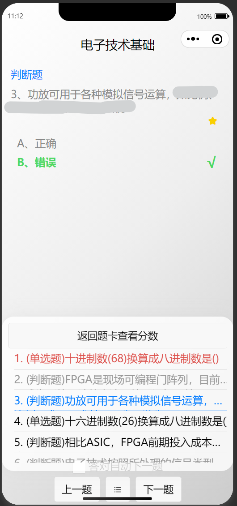
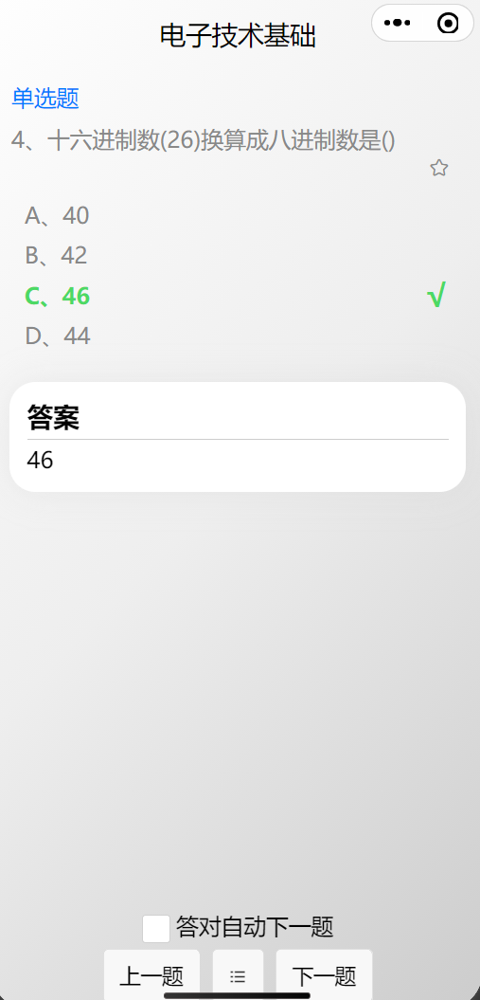
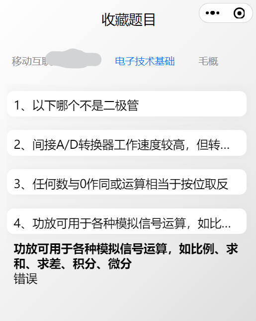

# uni-app-WeChat-DoExam

A do questions  mini program for WeChat based on Uni-App

一个基于uni-app开发的简易微信刷题小程序

本程序开源于[Github](https://github.com/SouthTea/uni-app-WeChat-DoExam)

仅前端部分（含有基本信息、抽题面板、答题记录-右滑动删除效果、题目收藏、答题界面及题卡-已答|未答|错误三种状态）

-  个人信息
  
  * 题库数量
  
  * 抽题记录
  
  * 刷题指数
  
  * 排行

- 抽题面板
  
  * 题库列表
  * 抽题数量

- 抽题记录
  
  * 题库标题
  * 创建时间
  * 答卷类型标签
  * 答题进度条
  * 分数

- ...

预览，请用微信扫码：

图片预览：

